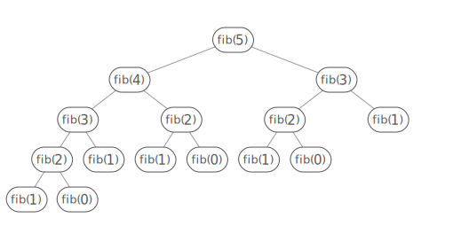
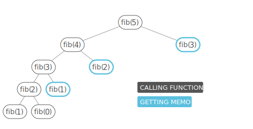

# Memoization

**Memoization** ensures that a method does **NOT** run for the same inputs more than once by keeping a record of the results for the given input(*usually in a hash map**).

For example, a simple recursive method for computing the Fibonacci number:

```js

const fib = (n) => {
  if (n < 0) {
    throw new Error('Index was negative. No such thing as a negative index in a series');
  }

  //Base Case
  if (n === 0 || n === 1) {
    return n;
  }

  console.log(`computing fib(${n})\n`, n);

  return fib(n - 1) + fib(n - 2);
}

```

Will run the same input multiple times:

```bash
# output for fib(5)
computing fib(5)
computing fib(4)
computing fib(3)
computing fib(2)
computing fib(3)
computing fib(2)
5
```

We can imagine the recursive calls of the method as a tree, where the two children of a node are the two recursive calls it makes. We can see that the tree quickly branches out of control.




To avoid the duplication work caused by the branching, we can wrap the method in a class that stores an instance variable, *memo*, that maps inputs to outputs. Then we simply:

1. check *memo* to see if we can avoid computing the answer for any given input, and
2. save the results of any calculation to *memo*.

```java
import java.util.Map;
import java.util.HashMap;

class Fibber {

    private Map<Integer, Integer> memo = new HashMap<>();

    public int fib(int n) {

        if (n < 0) {
            throw new IllegalArgumentException(
                "Index was negative. No such thing as a negative index in a series.");

        // base cases
        } else if (n == 0 || n == 1) {
            return n;
        }

        // see if we've already calculated this
        if (memo.containsKey(n)) {
            System.out.printf("grabbing memo[%d]\n", n);
            return memo.get(n);
        }

        System.out.printf("computing fib(%d)\n", n);
        int result = fib(n - 1) + fib(n - 2);

        // memoize
        memo.put(n, result);

        return result;
    }
}

```

```bash
# output of new Fibber().fib(5)
computing fib(5)
computing fib(4)
computing fib(3)
computing fib(2)
grabbing memo[2]
grabbing memo[3]
5
```


For this instance we are going to do this with an function rather than creating a class.


```js

//!recursive w/ memoization
function memoize(fn) {
  const cache = {};
  return function(...args) {
    if (cache[args]) return cache[args];

    const result = fn.apply(this, args);
    cache[args] = result;

    return result;
  };
}

//!recursive solution
function slowFib(n) {
  if (n < 2) return n;
  return fib(n - 1) + fib(n - 2);
}

const fib = memoize(slowFib);


```

```bash

# Placeholder for example calls

```

Now in our recurrence tree, no node appears more than twice:



Memoization is a common strategy for **dynamic programming** problems, which are problems where the solution is composed of solutions to the same problem with smaller inputs(as with the Fibonacci problem, above). The other common strategy for dynamic programming is **going bottom-up**, which is usually cleaner and often more efficient.